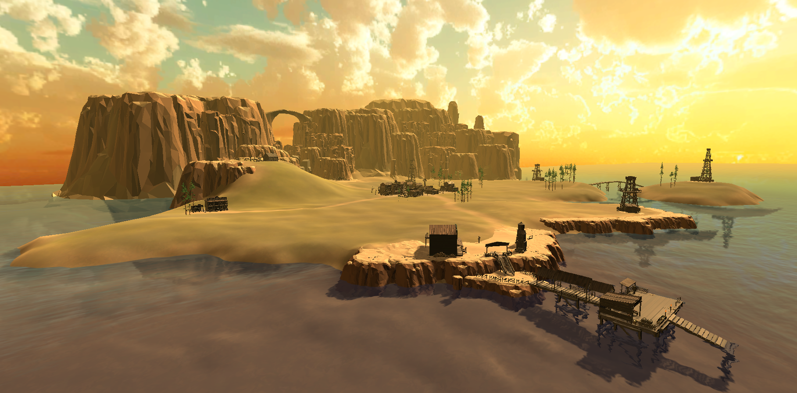
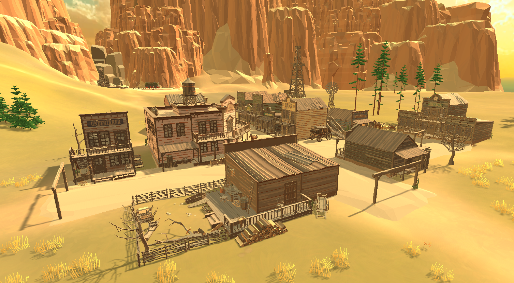
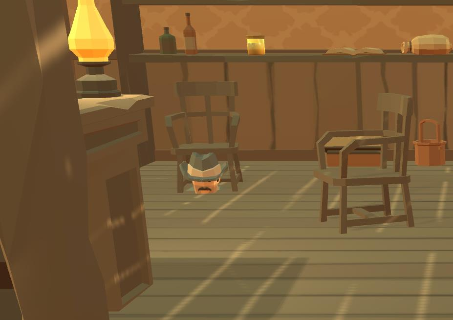

# Trouble in Golf Town

A small VR minigolf adventure that takes place in a small western town by the sea. The town lives with minigolf, and folks all around the town love the game. Unfortunately, a reserve of oil was found underneath the town. A rich oil magnate wants to transform the lovely minigolf town into an oil city. The townsfolk are angry about it, and to stop the oil magnate, they will use what they know the best -- minigolf.

## Team
- **Team name:** Mini VR Golfers
- **Members:**
    - Jan Chudy
    - Anna Moudra
    - Viktor Kacer
    - Jozef Valko
    - Jan Picka
    - Dominik Fryc

## Play the Game

**Download:**
[dev_build_v0.4](https://drive.google.com/drive/folders/15UYwMSD5zHKKdTVyJ9QN9G_vBHvcU1yM)

**Controls:**
Find controls for your platform in Main menu >> Help.

**Important notes:**
- You can now play the game to its completion on PC or VR headset.
- Look out for unique looking golf balls and make sure to find all of them.

    
## VHS Documentation

- [Milestone 1: Static world](./doc/vhs/static_world.md)
- [Milestone 2: Dynamic world](./doc/vhs/dynamic_world.md)
- [Milestone 3: Complex world with a story](./doc/vhs/complex_world.md)

## Documentation
- [Story](./doc/story.md)
    - [Lore](./doc/lore.md)
    - [Quests](./doc/quests.md)
- [Visuals](./doc/visuals.md)
    - [Assets](./doc/assets.md)
        - [3rd party assets](./doc/3party_assets.md)
        - [Original assets](./doc/original_assets.md)
    - [Animations](./doc/animations.md)
        - [Oil Tower explosion](./doc/oil_tower.md)
        - [Horse behavior](./doc/horses.md)
- [Scenes](./doc/scenes.md)
    - [Golf Plains](./doc/golf_plains.md)
        - [Golf Town](./doc/golf_town.md)
    - [Saloon](./doc/saloon.md)
    - [Church](./doc/church.md)
- [Characters](./doc/characters.md)
    - [Main characters](./doc/main_characters.md)
    - [Other NPCs](./doc/other_npcs.md)
- [Mechanics](./doc/mechanics.md)
    - [Productions](./doc/productions.md)
    - [Sound](./doc/sound.md)

### Bug Log
- Initial loading screen displays only skybox - would be nice to show scenery or team logo.
- NPCs sometimes sync their animation and are phasing through each other.
- Player can walk under water.
- Player can place golf ball directly into the hole on some courses.
- Sheriff gets beheaded at the local barber shop :,)
  

 #### Other features that did not make it into the project on time
 - Inventory sound effects for grabbing balls and switching clubs
 - minor NPCs dialogues and reactions