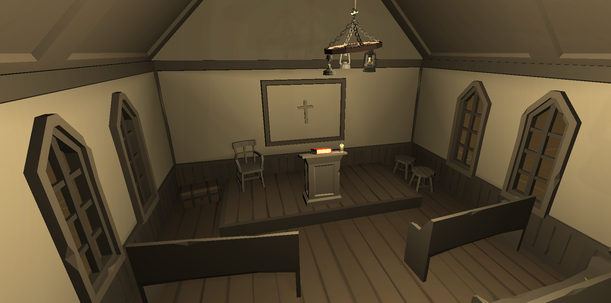
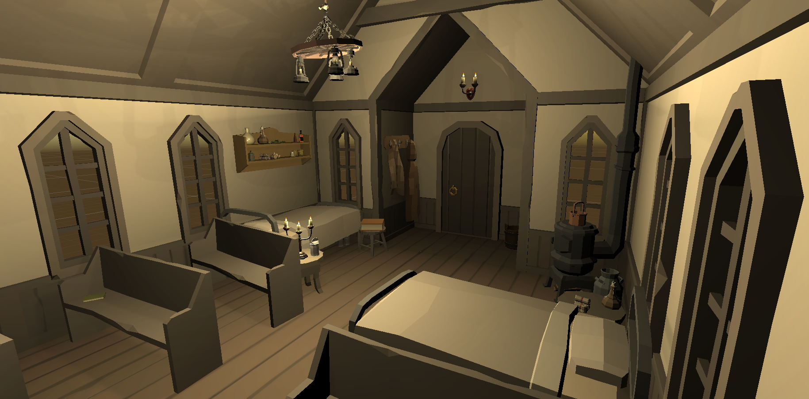

[Go Up](scenes.md)

# Church
The religious spirit of the residents of Golf Town has weakened since the discovery of minigolf. However, some of the townfolks still keep searching for answers here and seek the blessing for their upcoming minigolf tournaments.

During these harsh times, the religion shares this place with [Dr. Quinn](./main_chharacters.md)'s temporary infirmary, who is still missing the proper funding to build a town hospital.

## Infirmary section

The infirmary is located in the back of the church. [Dr. Quinn](./main_chharacters.md) can usually be found here taking care of her patients. There are two beds to accommodate the most severe cases. She has also installed a stove to keep the room warm and prepare food or medicine.

## Altar

The religious part of the church is in the front, where an altar can be found. Here townfolks come to pray before the most important minigolf tournaments.

## Story significance
In this scene, the story of this game begins. The player will be given a tutorial from [Dr. Quinn](./main_chharacters.md) and also instructions on where to find the town. The player will be able to get back inside the church at any time.