[Go Up](scenes.md)

# Golf Plains

After the discovery of the townfolks' beloved game called minigolf, the mayor of Golf Town named the land surrounding the local town Golf Plains. It is a small land on the west coast of North America. Unlike other towns around the west coast currently fighting over every drop of oil, this region lives peacefully playing minigolf.

Golf Plains are located at the very bottom of one of the westernmost peninsulas, having most of the coast area to the south and massive rocky cliffs to the north. The northern highlands separate the area from the rest of the peninsula. 

The land between the coast and the highlands is mainly flat, with the exception of a small hill in the north-west part of the area. Near the east coast, a small island can be found. The island is connected to the mainland by a small bridge.

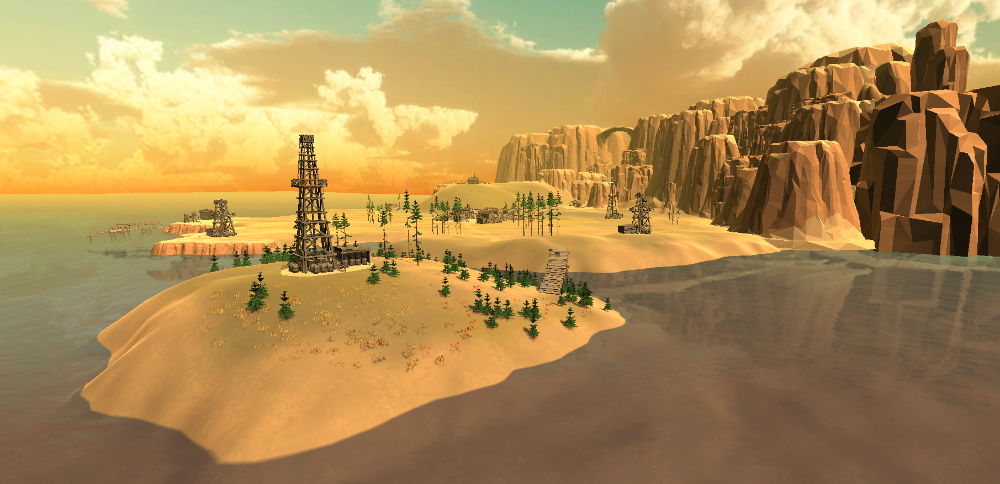

There are several important landmarks in the area. In the middle of the Golf Plains lies a small town called Golf Town, which is the heart of the area. On top of the hill north-west of the town lies a small church with a cemetery. The town used to be connected with the outer world with both the dock at the south coast and the train track through the northern highlands. Currently, only the dock is operating because of a recent landslide that blocked the train track. There are also a few minigolf courses spread throughout the land—most of them in the south-east area, other near the coast. West to the Golf Town, there is a newly built residence of a developer who recently moved to the area. The developer started building oil derricks around the minigolf courses to extract oil.

## Golf Town 

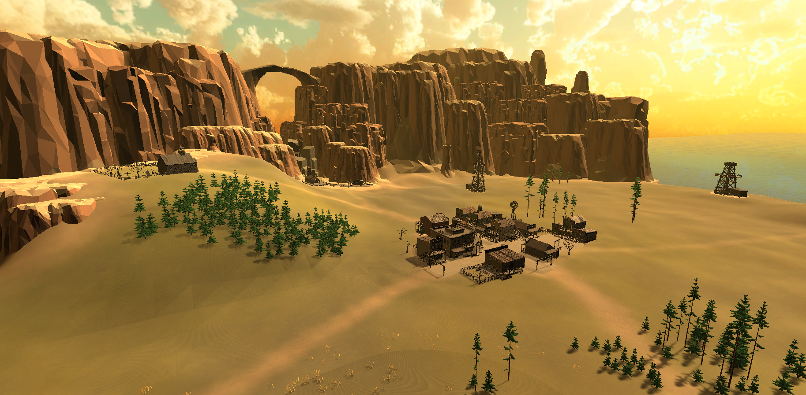

You can read more about the Golf Town on [this page](golf_town.md).

## Dock

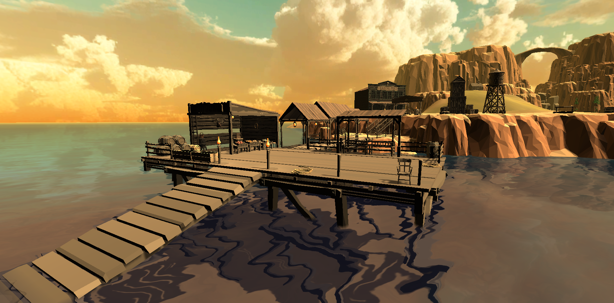

The dock area is located on the south coast of Golf Plains. The dock itself has been operational since any resident of Golf Town can remember. It is currently the only thing connecting Golf Plains with the outside world because of the recent unfortunate landslide that blocked the train track.

The most significant part of the dock area is the pier, which is stretching far to the sea. The pier is a charming place to go for a stroll during hot days. There is a small supply stand offering various goods from a foreign supplier.

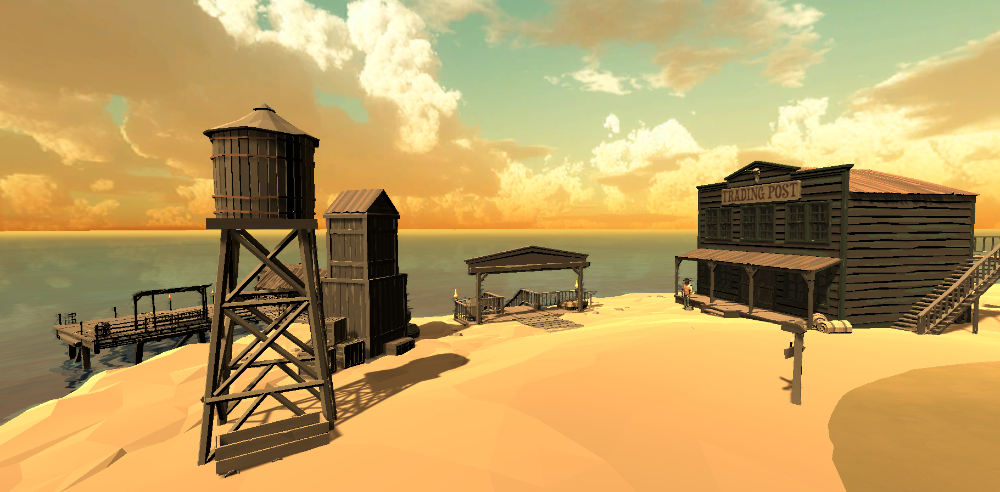

There is also an old trading post building at the dock. However, the trading post's days are long over, and it seems that The Wild Docker lives there currently. But no one knows because no one from the town was inside that building for ages.

## Cemetery
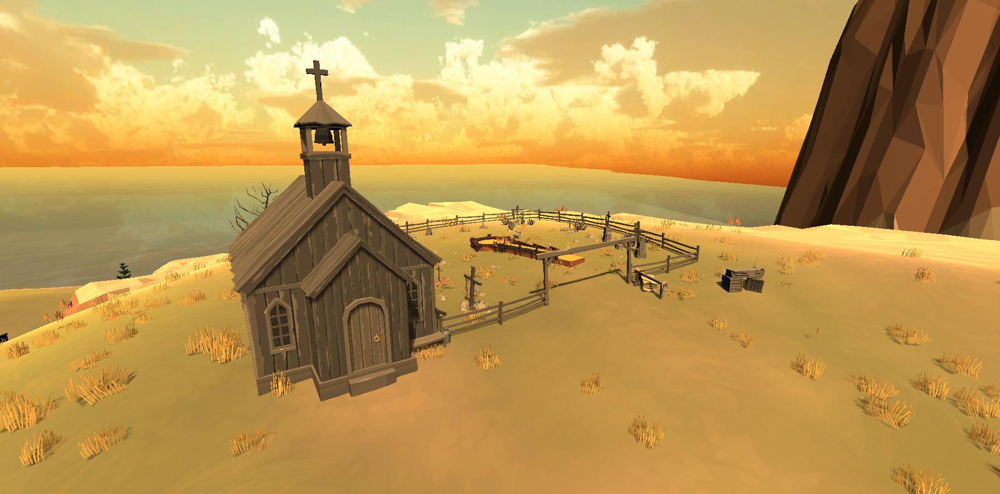

There is a local church with the cemetery on top of the hill north-west of the Golf Town. The church itself is very old and recently also started to serve as an infirmary of Dr. Quinn.

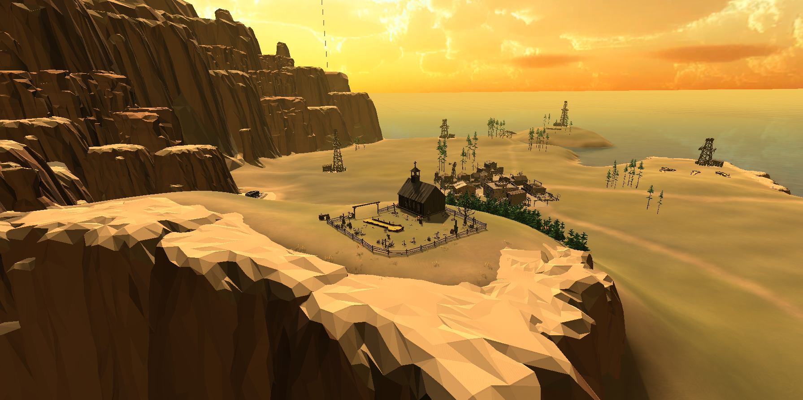

Some townsfolks, who recently lost their loved ones, come to the cemetery to mourn, while others visit for the hill's astonishing views. However, because of the cliffs that meet the ocean here, the area can be dangerous for drunk people.

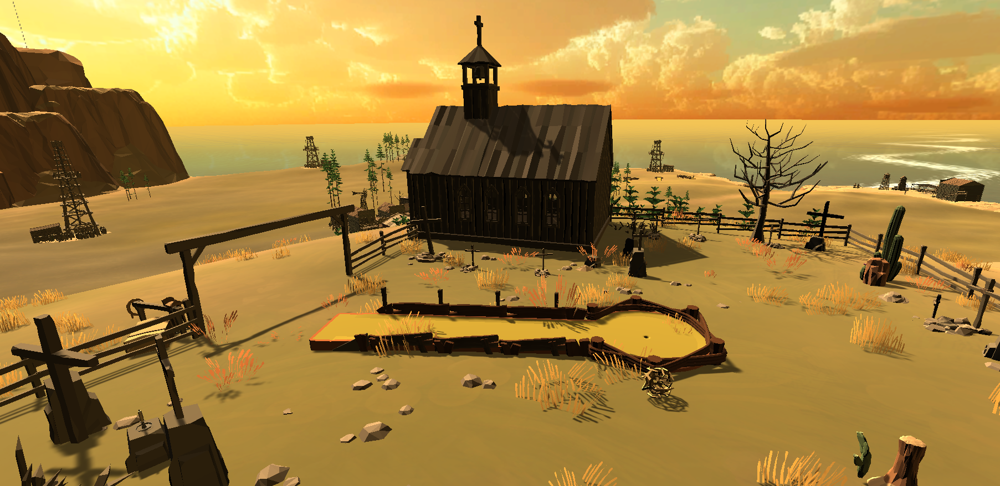

A small minigolf course was built on the premise of the cemetery in recent years. It started as a small Undertaker's joke that he used to say in the saloon. One day, however, few men from the saloon built the minigolf course at the cemetery. Some townfolks even believe that ghosts play minigolf here each Tuesday night.

## Train Station

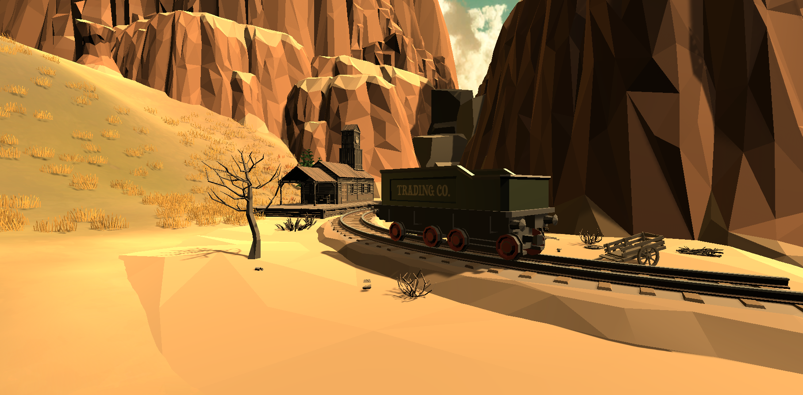

The train track passing the northern highlands connects Golf Plains with the rest of the peninsula. The track has been built during the gold rush and mainly used to transport materials and heavy machinery. Later, the whole system was repurposed for passenger transfer.

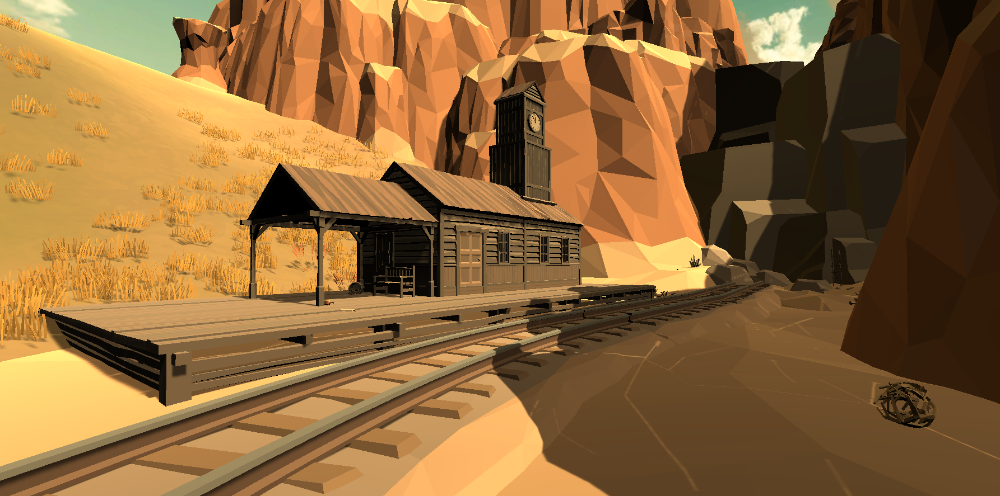

The train station was reconstructed several years after the train track started being used for transportation. However, the rail system was not really used in these parts, so the train station soon began to decay.

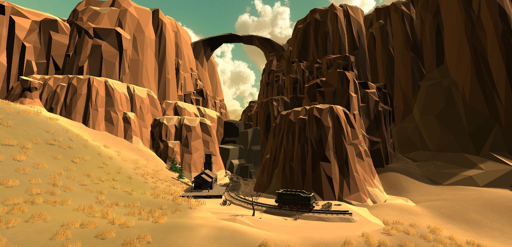

Very recently, a landslide that blocked the train track occurred. However, no one seems to be bothered by this because there is nowhere to travel since no other town has better minigolf courses.

## Developer's Residence

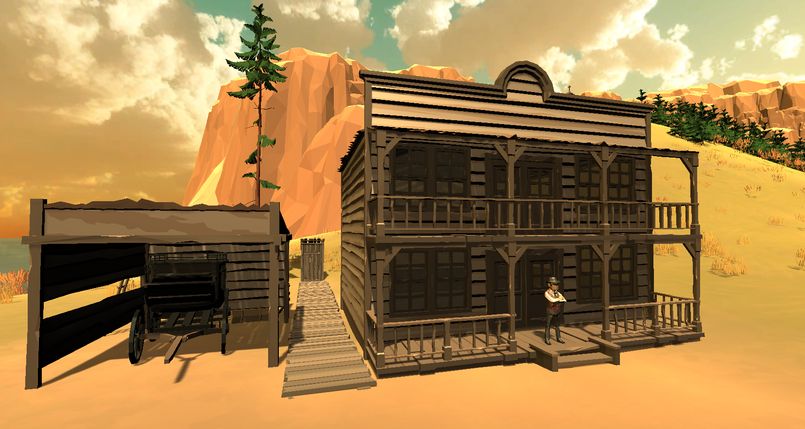

This residence was recently built by Ian McGimmy, an oil magnate who just moved to the area. This newest structure of the Golf Plains is located west of the Golf Town, just under the hill. 

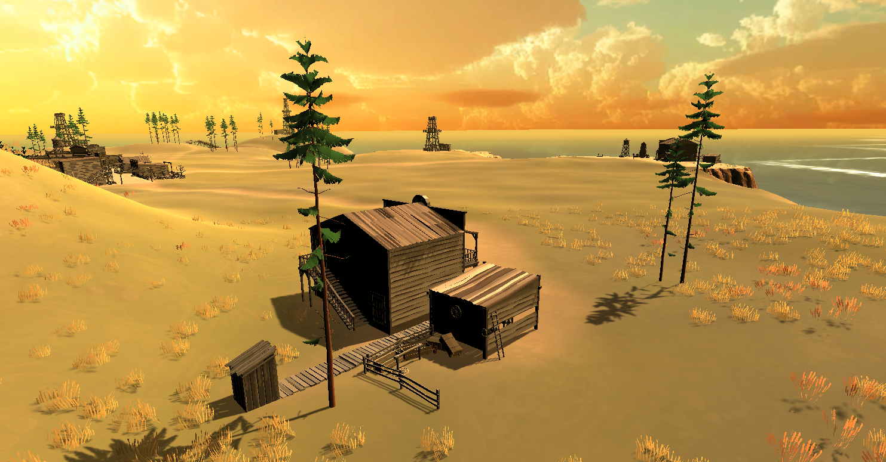

The residence consists of a large two-story mansion with a garage and a private outhouse. McGimme also built paddock for his horses and livestock he plans to relocate here from his farm in Oklahoma.

[Work In Progress]

## North-east Minigolf Park

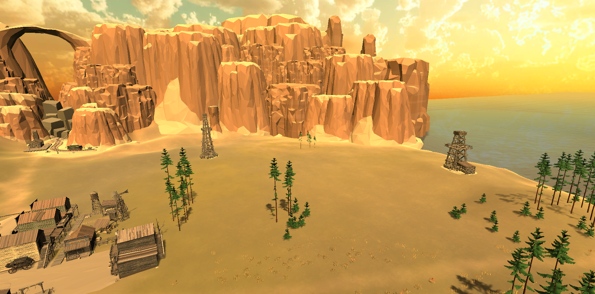

The North-east Minigolf Park is the biggest and most challenging minigolf park in the Golf Plains. It is conveniently located near the Golf Town and offers several minigolf courses for only the advanced golfers. It is very popular among the local players, and tournaments are taking place here at least once a week. 

[Work In Progress]

## Coast Side Minigolf

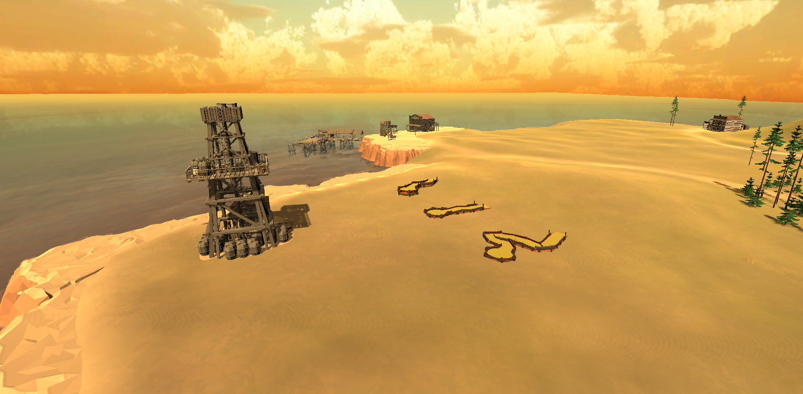

This minigolf area is located on the southern coast of Golf Plains, providing a few minigolf courses mostly for beginner and intermediate golfers. It is not far from the dock, and it can be enjoyable to play here.

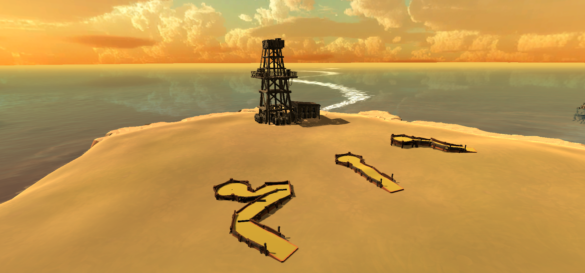

The downside of these minigolf courses is that beginners tend to lose their balls in the sea. But at least it gives the recreational divers something to hunt.

## Minigolf Island

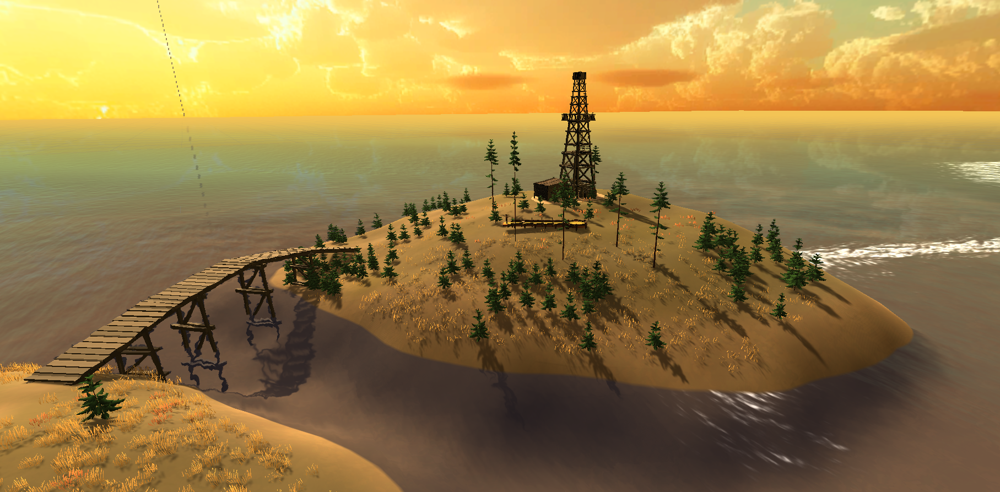

Minigolf Island is a small island near the east coast of Golf Plains. This tiny piece of land in the sea is a lovely spot for various activities, including walks, picnics, fishing, or whale spotting.

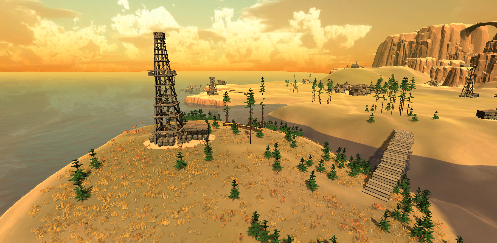

However, this place is known for something else among the true hardcore minigolf players from Golf Town. On this island, there are the most challenging minigolf courses from the whole Golf Plains area. Not everyone can finish the courses, and these courses' location makes it almost impossible to recover lost balls.

[Work In Progress]