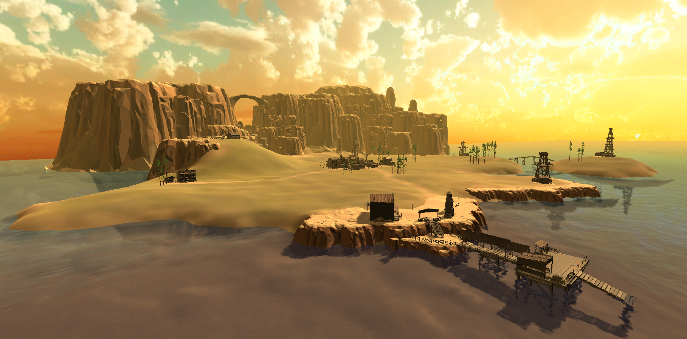
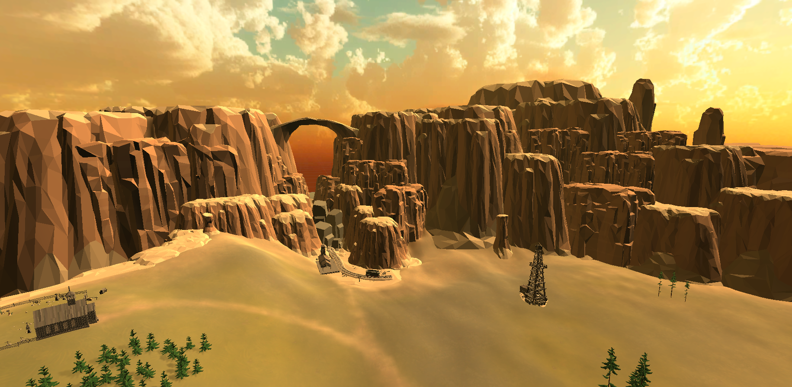
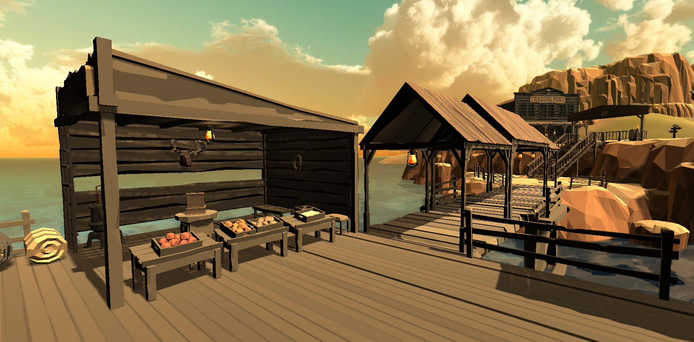

[Go Up](scenes.md)

# Golf Plains

After the discovery of the townfolks' beloved game called minigolf, the mayor of Golf Town named the land surrounding the local town Golf Plains. It is a small land on the west coast of North America. Unlike other towns around the west coast currently fighting over every drop of oil, this region lives peacefully playing minigolf.

Golf Plains are located at the very bottom of one of the westernmost peninsulas, having most of the coast area to the south and massive rocky cliffs to the north. The northern highlands separate the area from the rest of the peninsula. 

The land between the coast and the highlands is mainly flat, with the exception of a small hill in the north-west part of the area. Near the east coast, a small island can be found. The island is connected to the mainland by a small bridge.

There are several important landmarks in the area. In the middle of the Golf Plains lies a small town called Golf Town, which is the heart of the area. On top of the hill north-west of the town lies a small church with a cemetery. The town used to be connected with the outer world with both the dock at the south coast and the train track through the northern highlands. Currently, only the dock is operating because of a recent landslide that blocked the train track. There are also a few minigolf courses spread throughout the land—most of them in the south-east area, other near the coast. West to the Golf Town, there is a newly built residence of a developer who recently moved to the area. The developer started building oil derricks around the minigolf courses to extract oil.

## Golf Town 

You can read more about the Golf Town on [this page](golf_town.md).

## Dock

## Cemetery

## Train Station

## Developer's Residence

## North-east Minigolf Courses

## Coast Side Minigolf Courses

## Minigolf Island
