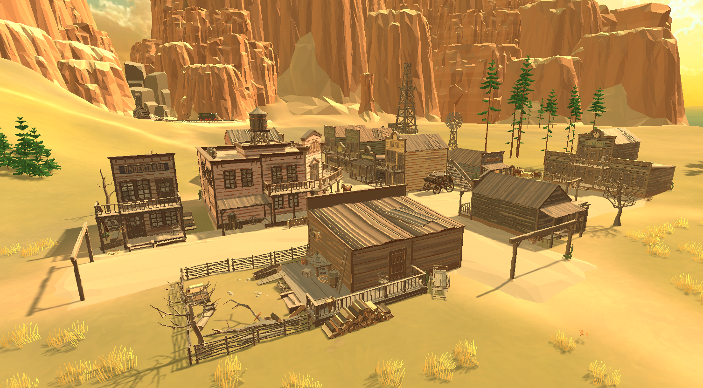
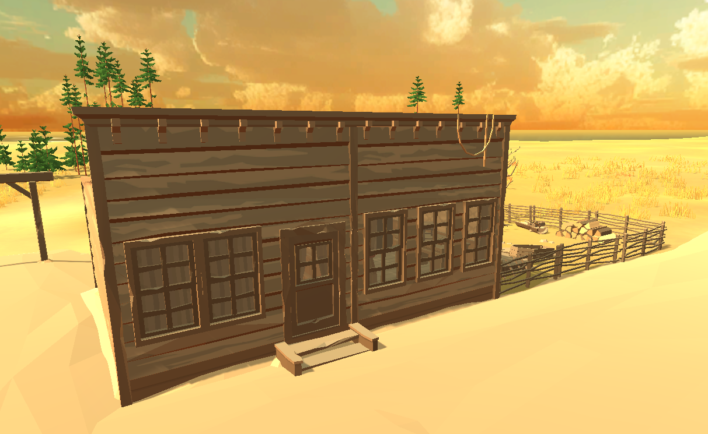

[Go Up](golf_plains.md)

# Golf Town

Golf Town is a small town that lives with minigolf. Two main perpendicular streets clump together nine buildings where residents live with their businesses.

## Entrances

There are three entrances to the town - south, north, and west entrance.

### South Entrance

The south entrance is currently viewed as the main entrance to the town since it is this entrance that brings new visitors from the dock.

### North Entrance

The north entrance connects the town with the train station and the church.

### West Entrance

West town entrance leads to the newly built developer's residence.

## Buildings and areas

### Saloon

**Interior furnished**: No (Saloon Scene)
**Interior accessible**: Saloon Scene
**Prefab**: *SM_Bld_Saloon_01* (modified)
**Texture**: *PolygonWestern_Texture_03_C*

### Town Hall

**Interior furnished**: Partially
**Interior accessible**: No
**Prefab**: Custom
**Texture**: *PolygonWestern_Texture_04_C*

### Supply Store

**Interior furnished**: Partially
**Interior accessible**: Partially
**Prefab**: *SM_Bld_Large_01*
**Texture**: *PolygonWestern_Texture_02_A*

### Grand Hotel

**Interior furnished**: Partially
**Interior accessible**: No
**Prefab**: Custom
**Texture**: *PolygonWestern_Texture_04_A*

### Sherif

**Interior furnished**: Yes
**Interior accessible**: No
**Prefab**: *SM_Bld_Jail_01*
**Texture**: *PolygonWestern_Texture_04_C*

### Bank

**Interior furnished**: Yes
**Interior accessible**: No
**Prefab**: *SM_Bld_Double_Preset_02*
**Texture**: *PolygonWestern_Texture_01_B*

### Area Behind The Hotel

### Barber Shop

**Interior furnished**: Yes
**Interior accessible**: Yes
**Prefab**: *SM_Bld_Single_Preset_01*
**Texture**: *PolygonWestern_Texture_03_B*

### Ammunition Store

**Interior furnished**: Yes
**Interior accessible**: No
**Prefab**: *SM_Bld_Single_Preset_02*
**Texture**: *PolygonWestern_Texture_04_C*

### Carpenter's House

**Interior furnished**: Yes
**Interior accessible**: No
**Prefab**: Custom
**Texture**: *PolygonWestern_Texture_01*

### Undertaker's House

**Interior furnished**: Yes
**Interior accessible**: No
**Prefab**: *SM_Bld_Double_Preset_01*
**Texture**: *PolygonWestern_Texture_03_A*

