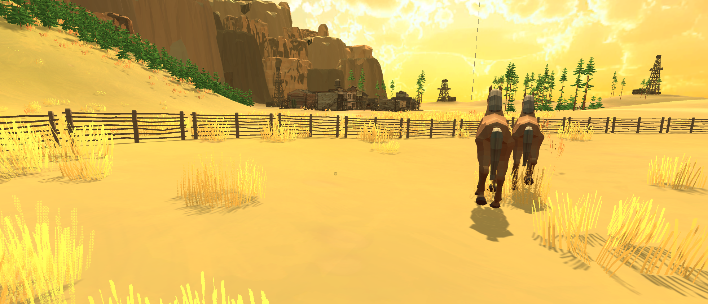

[Go Up](visuals.md)

# Horses

#### [Prefab](./original_assets.md)

### Animations
Horses have 3 original animations:
* Idle
* Eating
* Walking

### Behavior

Horses placed around the Golf Town are idle, patiently waiting for their next tasks. The horses near Magnate's residence are kept in an enclosure and free to roam around. The movement is restricted by navigation mesh, made so, that the horses cannot leave the enclosure, but the player can come in and out throught the gate.

Player can slip in through the semi-open gate and walk among the horses, but they will run away if he gets too close. Once the player is a safe distance away, they will resume their eating and walking around. The behavior is generated, for each horse, at random every few seconds.

