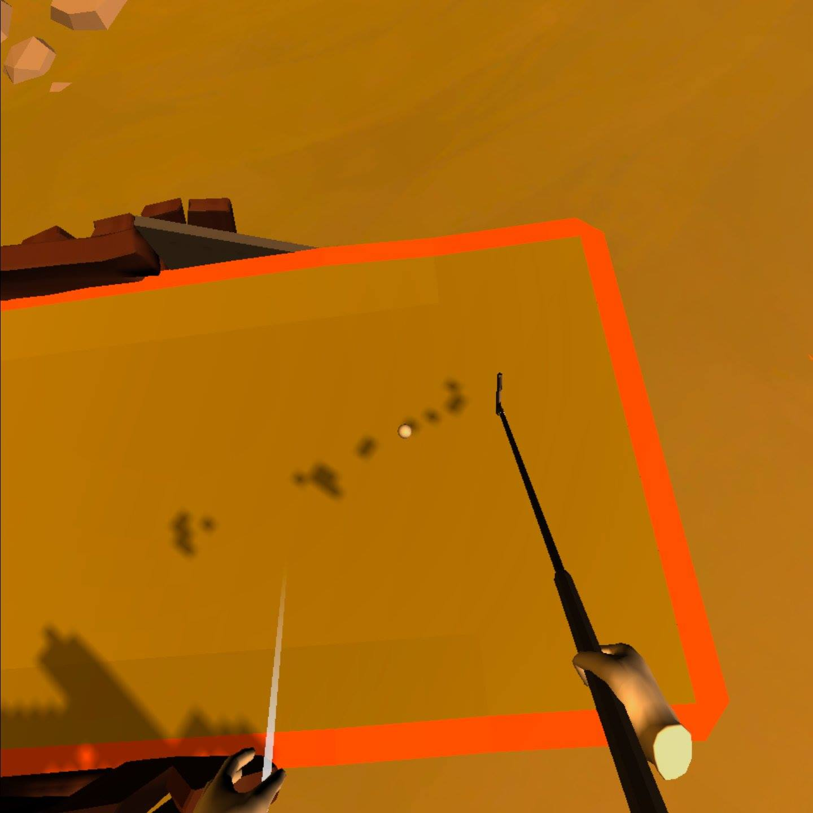
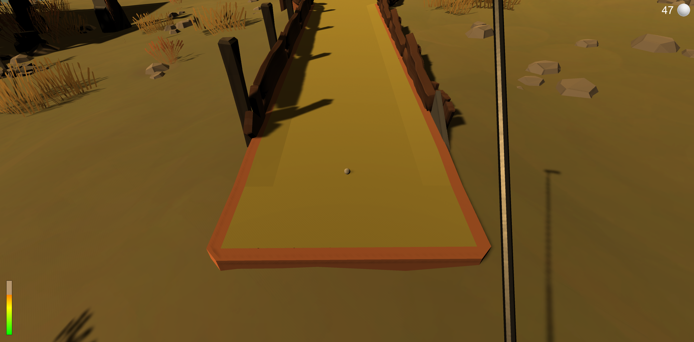
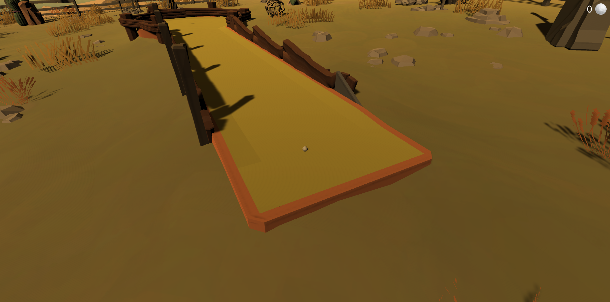
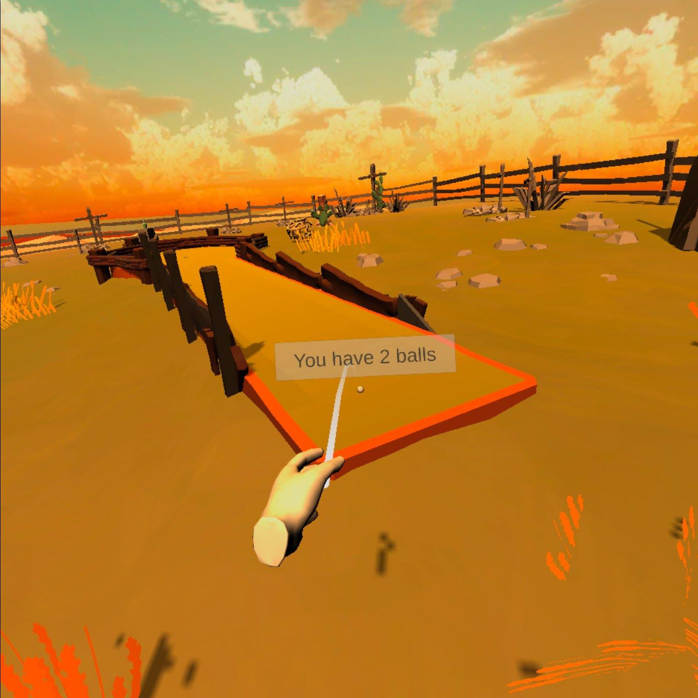
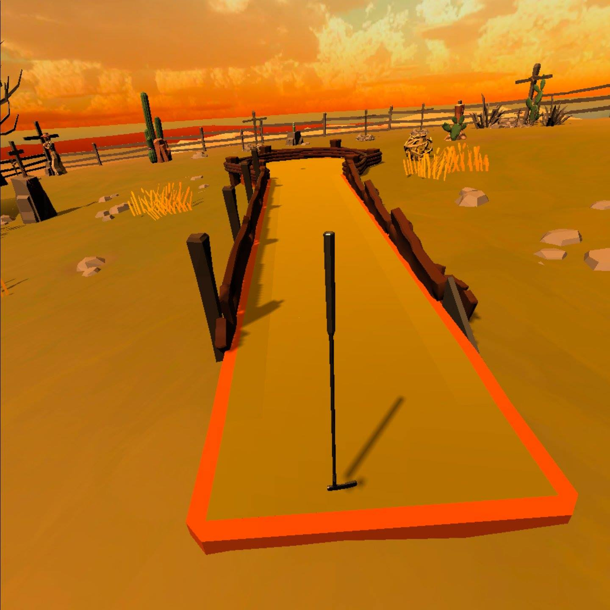
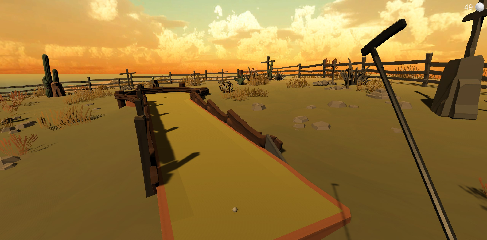

[Go Up](../README.md)

# Mechanics

This section is about how to play minigolf and how our inventory system works.

## Minigolf

### VR player

We used internal mechanics of detecting collision between club and ball in VR to play minigolf. We just had to tweak surface materials.

### PC player

From the beginning, we only intended gameplay on PC for debugging purposes. However, to make the game more accessible to our teams, as well as other potential players, our game now officialy supports gameplay on PC as well.

For PC, we had to implement very different logic, since the player does not have an object to swing with, using just the keyboard. We decided to use **player position** and the duration of press of the **left mouse button** to trigger force on the ball. This way, the player can set the direction and use the right amount of force even on PC, even if it's a bit awkward. 

Other actions within the game require keyboard input. Please see the Help section in the Main Menu for more information.

## Inventory

We tried to minimize differences between VR and PC gameplay, so we implemented the inventories basically the same, with only minor changes.

### Balls

For PC players, the number of balls currently in his inventory is displayed in top right corner of the screen. As we've found out, this approach cannot be used for VR players. So we implemented basic sign that is displayed above the ball when placing it on the ground.

To start the game, the player must first place the golf ball on the front of the golf course. This serves as a mechanic to stop the player from cheating, and dropping the ball directly next to the hole.
After the player is successfull, he can pick up the ball right from the hole, just as he would in real world minigolf. There is no explicit score board, that would show how many courses the player has completed or how many holes he played, as the journey is the goal with minigolf. However, keep in mint that some quests require the player to "practice", which translates to successfully playing several games of minigolf.

### Clubs

For the clubs, we didn't have time to properly think about how to display which club is in player's inventory. So we didn't do it. Player will have to try iterate through to find out, which clubs he has in inventory.

For PC player, we implemented the club levitating beside the player, when he has it in hand. The player cannot realistically swing the club, but the visual feedback is enough to understand that the player can play minigolf only when the golf club is visible, thus selected from the inventory. For VR players, this mechanics is understandably simpler, as he just spawns the club in front of him and grabs it.

