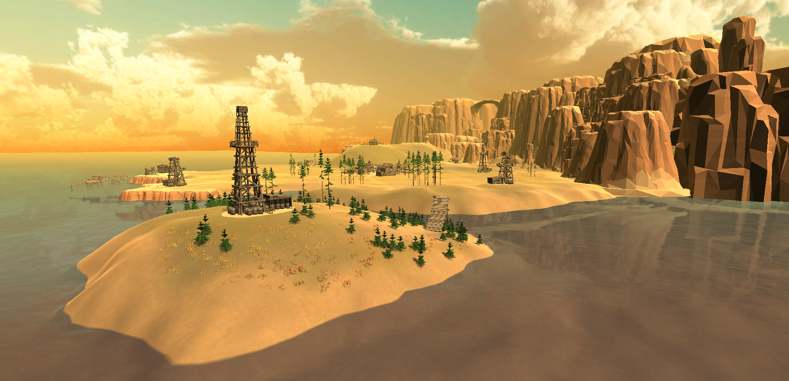

[Go Up](visuals.md)

# Oil Towers
Oil Tower or Oil Rigs illistrate the power of Ian McGimmie over the Golf Plains. They are rather ugly structures placed around the Plains, blocking views and ruining the joys that golfing on the fresh air offers. Eventually, the player must destroy all of the towers with his mighty golfing skills, so the townsfolk can return to their favorite hobby and way of life. 

### Explosion

The destruction of the the tower is animated as explosion of the Tower prefab with smoke rolling from underneath. The destructed tower then slowly shrinks out of sight, leaving nothing but bare ground.

Right now, the explosion of all towers is triggered at once, by pressing the D key. For future use, all of the placed towers contain box collider for detecting collision with a golf ball.

