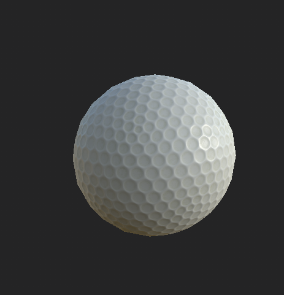
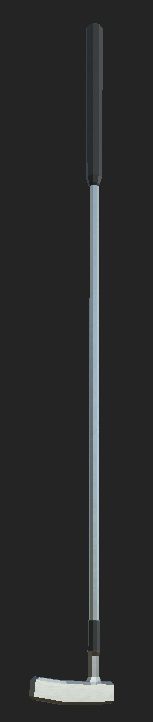
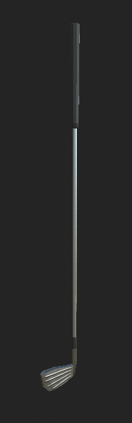
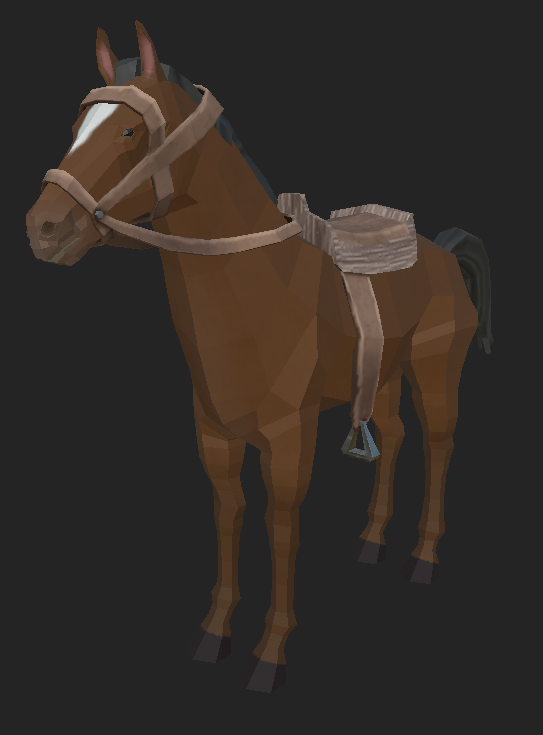
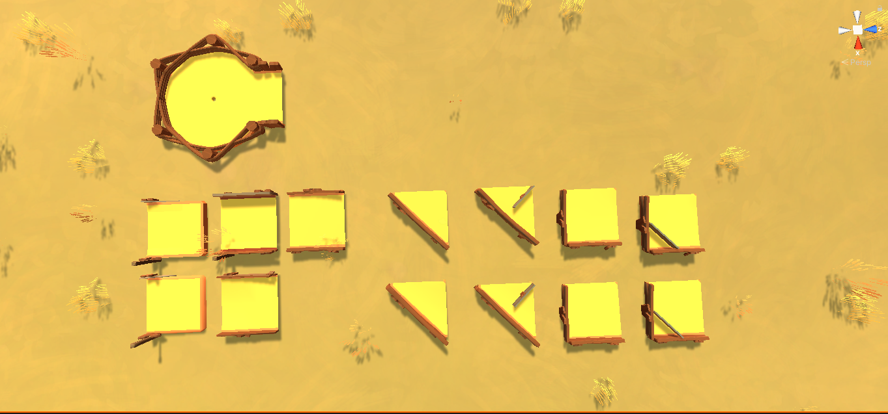
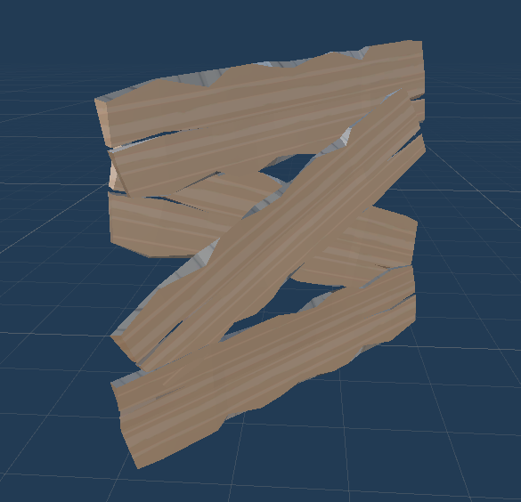

[Go Up](assets.md)

# Original assets
We have created several assets for the game ourselves.

## Golf equipment
We have created two golf clubs and a golf ball model.

  
 

## Hores
We have created our own low-poly horse model.

## Modular minigolf courses
We have modeled a modular minigolf course tiles that can be used to design and construct minigolf courses inside Unity.

## Planks
Planks for saloon door window.

