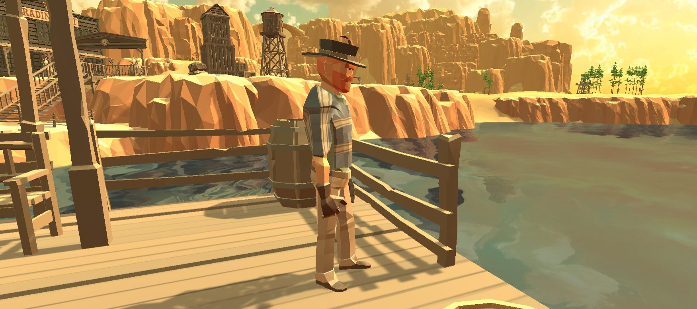

[Go Up](characters.md)

# Other NPCs
There are currently 21 non-playable characters in the game with non-significant gameplay.

## Lisa and Joe

Lisa and Joe are good friends bonding over their cowboy ways. They seem to be a good company, but mostly to each other, and certainly not to strangers. They sit beside the campfire, often visit the saloon and you can even meet them on a stroll to the tiny island.

## Sheriff and Barber

The sheriff of Golf Town is not a memorable figure. He used to be enamored by his [Golf Town](golf_town.md), but since Ian McGimmie came to town with his business the sheriff became more and more closed off. He rarely visits the [Saloon](saloon.md) and mostly can be found on the road from the once beautiful Rail Station to the Docks. He visits the barber daily to keep up his visage, at least, as he cannot help his town.

The Barber is a talkative guy but he keeps his services costly. When he is not tending customers in hi shop, you can meet him in the [Saloon](saloon.md) or chatting with Old Dave.

## Old Dave

Old Dave is a local legend, once the Master Golfer, used to be the best player in all of [Golf Town](golf_town.md). His glory days are over now and he spends his days in various chairs around the town, reminiscing about the past. He might have a good advice or two.

## Miss Jane

Miss Jane is always waiting for someone, either somewhere in [Golf Town](golf_town.md) or the Docks. Sometimes she forgets herself and waits at the old Railway Station too.

## Supply Owner

Having the only Supply Store in town, the Supply Owner is keeping his customers close to heart, but his money even closer. He does not mind the new oil business in town as long as the Oil Tower operators buy his goods and his only worry is the new Supplier in the Docks. He does not leave his store, are you crazy? Someone could steal from him!

## Sisters Angelica and Peggy

The two sisters used to spend their youth playing their favorite game, minigolf, but nowadays, with Oil Towers looming over their favorite courses, they spend most of their time chatting at the Supply Store or in nearby Saloon.

## Oil Tower Operators

Each oil tower needs a little upkeep, at least that's what the townsfolks heard. Life so high up is dangerous and the men there keep to themselves. Every few months, someone mysteriously falls to their death. Could it be the wind?

## Widow

Rumor has it, her late husband, an oil tower operator, warned the developer against drilling the 4th oil rig... The next she knew, the hunter found her husband under the unfinished tower. Heartbroken, she does not mingle with the townsfolk and comes to cry at his grave every day.

## Hunter Larry

Hunter Larry is always doing what he knows best - hunting. It's not like he saw any game across the Golf Plains in recent years, but he can make do with mostly anything.
Be quiet when you meet him on his hunt, you don't want to frighten away his glorious weeds!

## Beau and Austin

Father and son duo, who practically don't leave the [Saloon](saloon.md), where they drink to the memories of wonderfull minigolf games and worlds without oil magnates.

## Visitors

At any given point in time, there are a few more visitors at the [Saloon](saloon.md). When enough of them gather, they like to play a game of poker or put work to the old piano hiding in the corner.

## Frank

## Sally

## Dock Hand Hank

## Foreign Supplier
