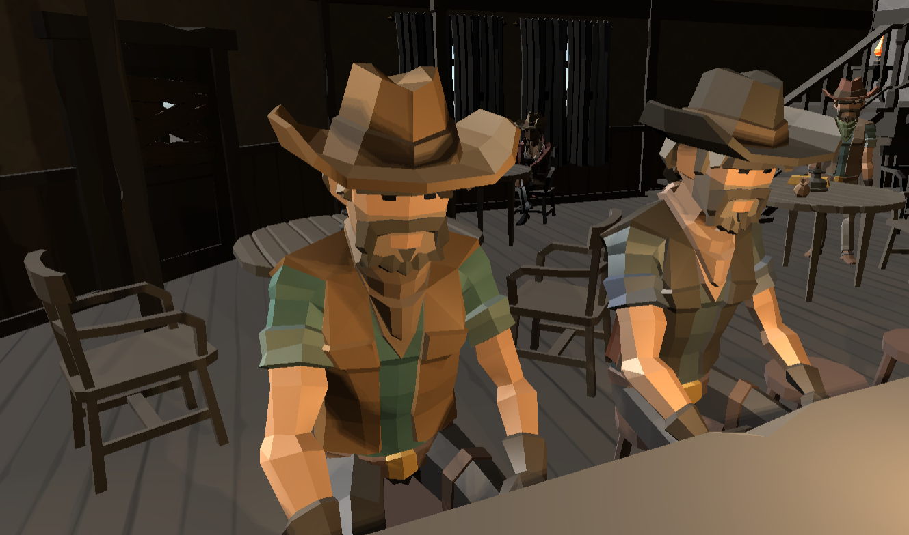

[Go Up](characters.md)

# Other NPCs
There are currently 21 non-playable characters in the game with non-significant gameplay.

## Lisa and Joe

Lisa and Joe are good friends bonding over their cowboy ways. They seem to be a good company, but mostly to each other, and certainly not to strangers. They sit beside the campfire, often visit the saloon and you can even meet them on a stroll to the tiny island.

*Behaviour:* 
     
* Sit and chat by fireplace
* Randomly walk in pair around the Plains
* Visit Saloon together and drink 

## Sheriff and Barber

The sheriff of Golf Town is not a memorable figure. He used to be enamored by his [Golf Town](golf_town.md), but since Ian McGimmie came to town with his business the sheriff became more and more closed off. He rarely visits the [Saloon](saloon.md) and mostly can be found on the road from the once beautiful Rail Station to the Docks. He visits the barber daily to keep up his visage, at least, as he cannot help his town.

The Barber is a talkative guy but he keeps his services costly. When he is not tending customers in hi shop, you can meet him in the [Saloon](saloon.md) or chatting with Old Dave.

*Behaviour:* 
     
  Barber:  
* When Sheriff is in shop, stands behind him on loop
* When shop is empty is either in Saloon, drinking
* or Stands by chimney 
    * {if approached by player, asks him to leave unless he can pay}

Sherrif:  
* When in Barber shop, sits on chair
* Walks randomly around the town
    * {when he wants to sit on his chair, but Dave sits on it, they'll start arguing}

## Old Dave

Old Dave is a local legend, once the Master Golfer, used to be the best player in all of [Golf Town](golf_town.md). His glory days are over now and he spends his days in various chairs around the town, reminiscing about the past. He might have a good advice or two.

* Walks through town and sit in various chairs around town
    * {if approached by player, gives tips on playing (destroying towers)}

## Miss Jane

Miss Jane is always waiting for someone, either somewhere in [Golf Town](golf_town.md) or the Docks. Sometimes she forgets herself and waits at the old Railway Station too.

*Behaviour:* 
     
* Waits on bench on Saloon deck  
* Waits on bench at Railway Station deck
    *
* Waits standing near fireplace
* Waits standing on little island

    * {if approached by player, asks to be left alone}

*When all Towers are destroyed:* Can be seen walking around Golf Town, happy that all towers are destroyed. [player triggers excited message] 

## Supply Owner

Having the only Supply Store in town, the Supply Owner is keeping his customers close to heart, but his money even closer. He does not mind the new oil business in town as long as the Oil Tower operators buy his goods and his only worry is the new Supplier in the Docks. He does not leave his store, are you crazy? Someone could steal from him!

*Behaviour:* 
     
* Stands in Supply Store behind counter

*When all Towers are destroyed:* Is upset that everyone plays golf now, instead of shopping and is closing store.

## Sisters Angelica and Peggy

The two sisters used to spend their youth playing their favorite game, minigolf, but nowadays, with Oil Towers looming over their favorite courses, they spend most of their time chatting at the Supply Store or in nearby Saloon.

*Behaviour:* 
     
* Walk around Supply Store
    * {if approached by player, explain how they miss playing golf}    

*When all Towers are destroyed:* Can be seen around playfields, chatting, holding sticks. 

## Oil Tower Operators

Each oil tower needs a little upkeep, at least that's what the townsfolk heard. Life so high up is dangerous and the men there keep to themselves. Every few months, someone mysteriously falls to their death. Could it be the wind?

*Behaviour:* 
     
* Move up and down on ladders    
    * {when tower is destroyed, are respawned next to dirtpile and randomly walk around the world (or they die, cue two new graves :])}

## Widow

Rumor has it, her late husband, an oil tower operator, warned the developer against drilling the 4th oil rig... The next she knew, the hunter found her husband under the unfinished tower. Heartbroken, she does not mingle with the townsfolk and comes to cry at his grave every day.

*Behaviour:* 
     
* Cries at the graveyard
    * {if approached by player, explaines what happened to her husband}    
* Sits on a bench in Church (is not in World Scene)
    * {if approached by player, asks to be left alone}

*When all Towers are destroyed:* Can be seen walking around Golf Town, happy that all towers are destroyed. [player triggers excited message] 

## Hunter Larry

Hunter Larry is always doing what he knows best - hunting. It's not like he saw any game across the Golf Plains in recent years, but he can make do with mostly anything.
Be quiet when you meet him on his hunt, you don't want to frighten away his glorious weeds!

*Behaviour:* 
     
* Hides in forest and tries to blend in

## Beau and Austin

Father and son duo, who practically don't leave the [Saloon](saloon.md), where they drink to the memories of wonderfull minigolf games and worlds without oil magnates.

*Behaviour:* 
     
* Sit behind bar and drink
    * {player triggers random quotes about the unfairness of life}  

*When all Towers are destroyed:* Can be seen walking around golf courses, holding sticks.

## Visitors

At any given point in time, there are a few more visitors at the [Saloon](saloon.md). When enough of them gather, they like to play a game of poker or put work to the old piano hiding in the corner.

*Behaviour:* 
     
* Various drinking positions    
    * {unique activity: when Saloon population >8?, start playing poker?}

## Frank

Frank may look like a brawler, but when he's with his bottle, he might be the happiest man around. He is a regular at the Saloon and from time to time takes his beloved bottle for a walk. When you meet him, make sure not to disturb his circles.

*Behaviour:* 
     
* appears in Saloon -> (is not in World Scene but in Saloon)
    * sits in Saloon behind bar and drinks from bottle     
* walks in circles behind fireplace

*When all Towers are destroyed:* Prepares (inspects his stick club) for a game of minigolf beside a golfing course. 

## Sally

Sally is a easy going helper at the Dock. She used to handle incoming supply of golf equipment, but nowadays just lounges around. This is a dead town, maybe she'll leave with the next ship.

*Behaviour:* 
    
* sits on the package -> 
* walks to Golf Town ->   
* appears in Saloon -> (is not in World Scene but in Saloon)
    * sits in Saloon behind table and drinks       
* walks from Town to the Dock -> repeat

*When all Towers are destroyed:* Waits on the Pier on her next shippment of golfing supplies. [player triggers excited message] 

## Dock Hand Hank

Hank is a thorough dock hand, patiently waiting for the next ship. From his pier, he used to enjoy watching players on nearby minigolf courses, now he only has the company of oil towers and fish. 

*Behaviour:* 
    
* stands on the end of the pier, next to the benches and stares into the sea -> 
* walks randomly on the pier
* walks to his starting position -> repeat

*When all Towers are destroyed:* Waits on Pier but looks to nearby golfing courses. [player triggers excited message] 

## Foreign Supplier

Foreign Supplier surely has a name, but noone can understand him in this little town. Nonetheless, his prices are good so the townsfolk take him as their own. Well, most of them anyway. Foreign supplier does not dare to step in the Supply Store. He divides his time evenly between his little marketplace on the pier and the rest od the Dock, looking out for the next ship.

*Behaviour:* 
    
* stands in the midsection of the dock and stares into the sea -> 
* walks to his market on the Pier (behind the counter) 
*  waits for customers -> 
    - {if Sheriff is nearby - they chat} -> 
    - {if player interacts FS speaks in gibberish} -> 
* walks to mid section of dock -> repeat

*When all Towers are destroyed:* Waits near Supply Store to replace Supply owner.

