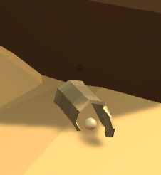
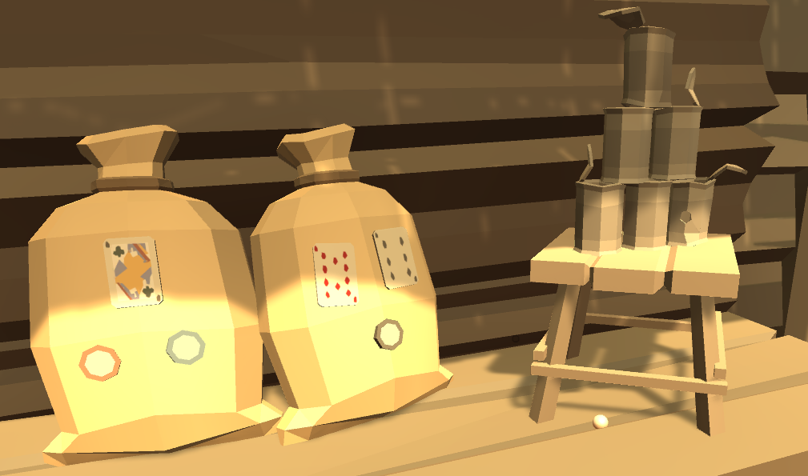

[Go Up](mechanics.md)

# Productions

So far, there are two productions in the game—a tumbleweed generation and a golf ball spawning.

## Golf Ball Spawning

We have implemented a random golf ball spawning mechanic. This mechanic spawns golf balls randomly in the predefined locations. This mechanic is essential for the gameplay because it ensures that the player can run out of golf balls and always look for more in the world.

The spawn locations can be added to the game simply by placing the spawn location prefabs to the scene. Each of these locations can be configured separately to set up the probability with which a ball is spawned on that location. During the game, the Game Manager can refresh all locations and respawn a new batch of balls. This can be done, for example, during a scene change. 

When a ball is spawned, a prefab that has the necessary scripts to support the player's interactions is instantiated.

## Tumbleweed

We have placed several tumbleweed effects on the main scene to enhance the world's aesthetic and dynamicity. These effects generate tumbleweeds that are then moving through the scene and bumping into other objects.

