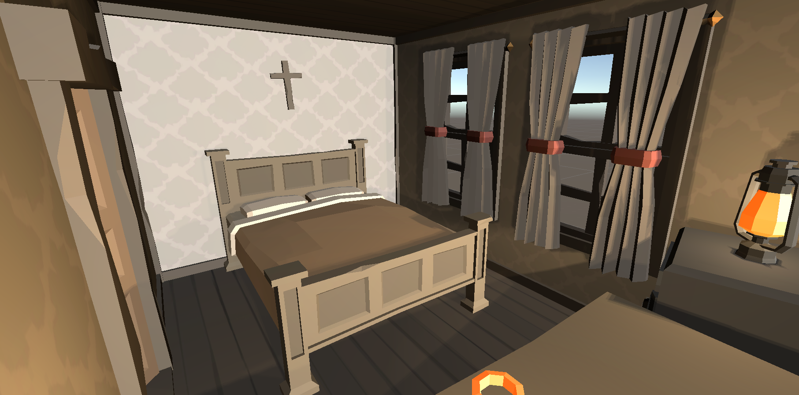

[Go Up](scenes.md)

# Saloon
The saloon is the heart of Golf Town. Townfolks all around the town come here to enjoy alcohol and endless discussions about their minigolf achievements and tactics. [Drunken Joe](./main_characters.md), who owns the saloon, is always behind the bar ready to pour you a glass of old whiskey or listen to you explain why you lost your last tournament.

Ever since the discovery of minigolf, the atmosphere in the saloon was pretty cheerful. There have been no fights lately because townfolks prefer to sort their problems on the minigolf courses.

Townfolks don't only discuss their minigolf tactics in the saloon. They also play poker, enjoy music, and the company of the saloon girl [Dixxi](./main_characters.md). 

## Storage
There is a storage room behind the bar, where [Drunken Joe](./main_characters.md) stores all the goods offered by the saloon. It is very cramped in there, and no one but Joe should go there.

## Rooms
On the second floor of the saloon, there is a big outdoor terrace and three rooms for saloon visitors. Some travelers prefer to book a room in the saloon instead of the hotel. And for a good price, [Dixxi](./main_characters.md) can take care of their minigolf equipment.

Even though the rooms can be small for someone and less comfortable than in the hotel, they are still reasonably furnished. Furthermore, a glass of whiskey is always only a few steps away.

## Story significance
[Drunken Joe](./main_characters.md) is one of the main characters in the game that wants to stop the developer from turning Gold Town into an oil city. Therefore the player will interact with Joe several times during the game to obtain or complete quests. 

The player can also use [Dixxi](./main_characters.md)'s services any time there is something wrong with their golf club. The saloon is open for the player all the time.