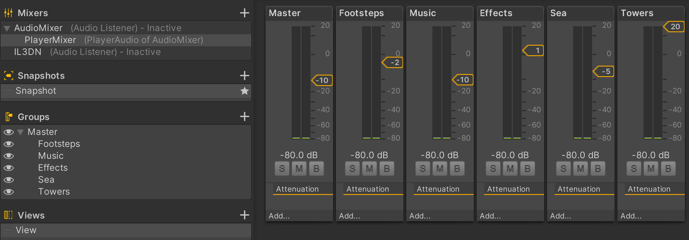
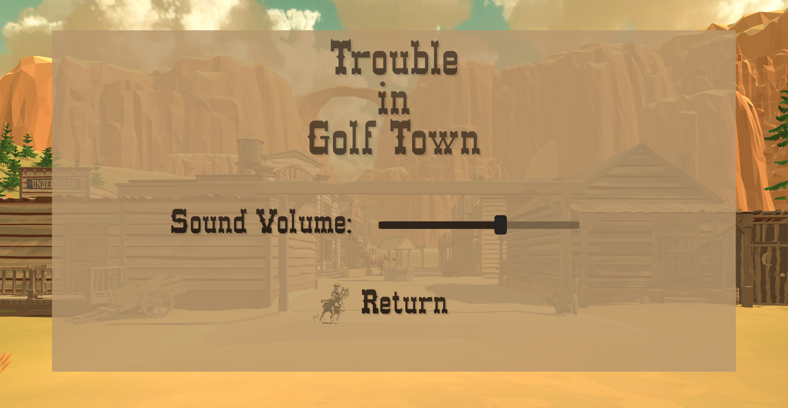

[Go Up](../README.md)

# Sound

Each sound source is linked to an audio group in sound mixer:
  

 The master volume can be set in Main menu -> Settings:
  

### Footsteps
Player can hear his own footsteps on the ground and on the wooden floors, as well as footsteps of other individuals walking around Golf Town, the Dock or in the Saloon.

### Golf balls
Golf balls fire sound effect on collision with other game objects.

### Towers
All towers make ominous industrial sound until they are destroyed. It is only then that the player can enjoy the true joy of silence, water splashing around and birds singing in the trees. However, be prepared for a mighty explosion sound when the towers are destroyed, afterall, this is a dangerous business!

### Menu music
Whenever player pauses game, menu music slowly fades in and then fades out again when player resumes the game. Whenever player sets the sound volume in settings, he can immediately get feedback. 

### Saloon music
 Music coming from the Saloon can be heard outside. Once player comes in, he can hear the music is comming out of the gramophone in the back of the Saloon.

### Environment sounds
- Sounds of sea
- Birds start singing when close to trees
- Tumbleweeds in town are rustling perioadically
- Horses periodically snort when player is close, and horses in enclosure make sound when walking.

