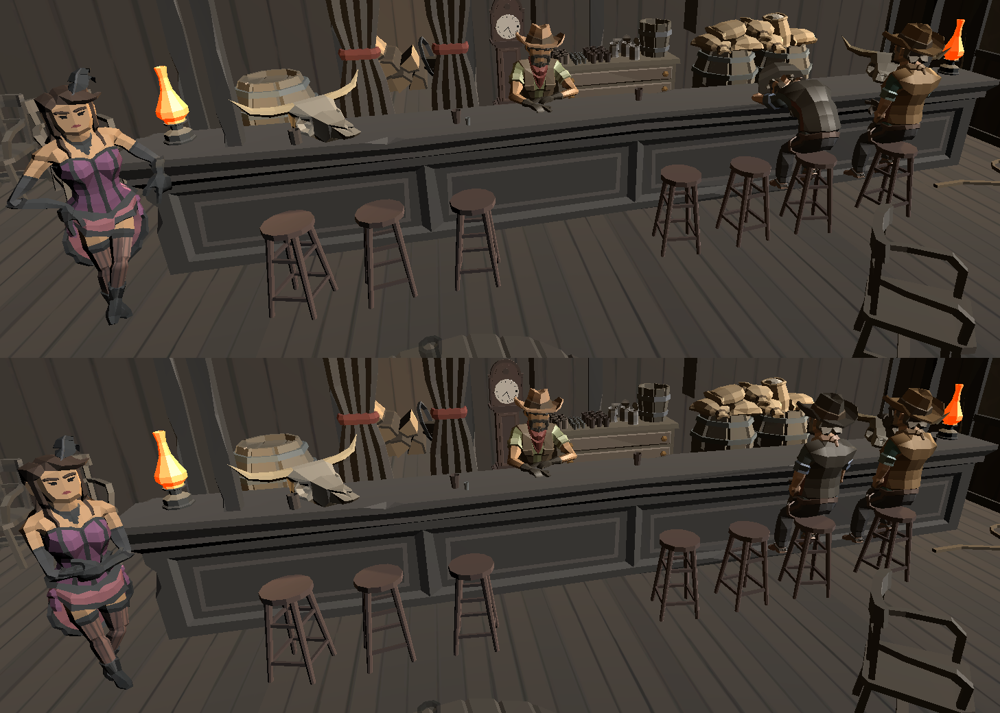
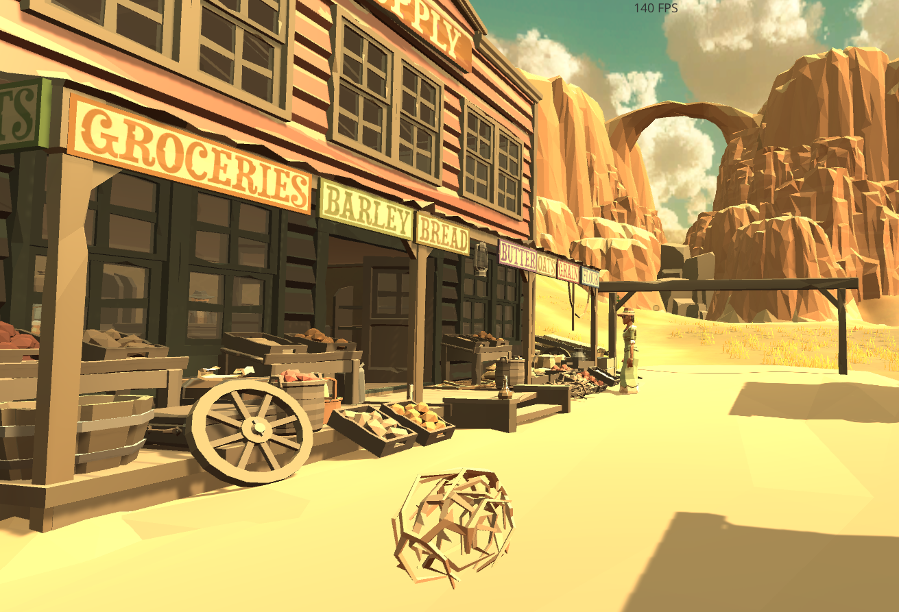
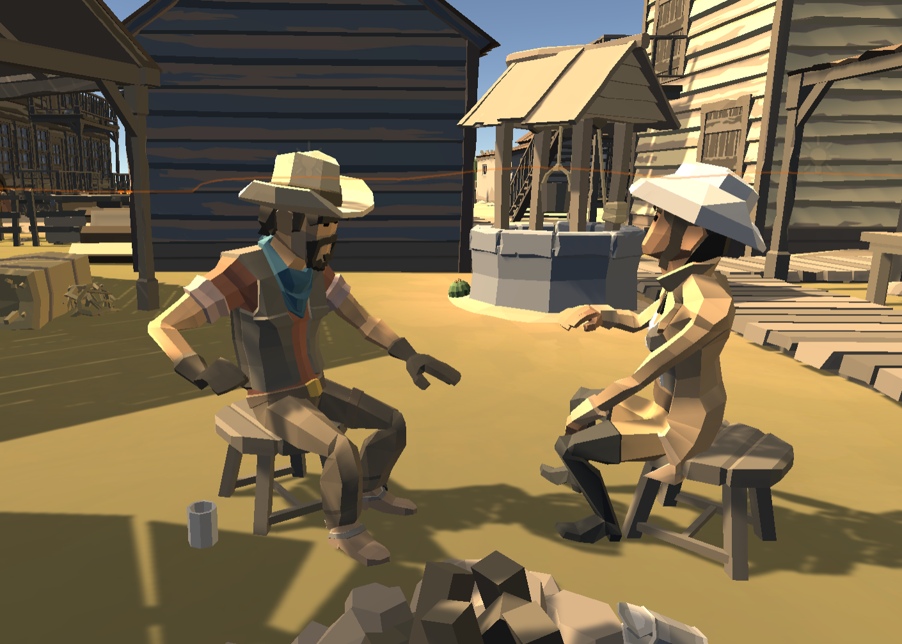

# Dynamic World

This page is more of an overview of the semestral project requirements and how the game fulfills them. It provides links to the primary documentation, which provides more detailed information and backstory.

## Animations

All of the characters in the game are animated. Some of them move around the map, and some only have idle animations. Our [main characters](../main_characters.md) are so far stationary, having several idle animations and change them regurarely. However, the [secondary NPCs](../other_npcs.md) also move around the map, have their cyclic activities, and follow certain behavior.

We have both created our original animations and used already existing ones.

### Most relevant documentation pages:
- [Animations](../animations.md)
- [Characters](../characters.md)
    - [Main characters](../main_characters.md)
    - [Other NPCs](../other_npcs.md)
    
[Todo] update list (navigation?)

## Productions

We have created two major productions. One only for aesthetic purposes and the second one has an impact on the gameplay.

### Most relevant documentation pages:
- [Productions](../productions.md)

## Behavior

There are several behaviors some NPCs follow. Some of the behaviors are triggered later in the game when the player performs some actions; some are triggered by a random chance when two certain NPCs meet, or a group of NPCs is present in a specific area.

We have also created a horse behavior that the horses on the Magnate's farm follow. The horses walk around and eat, but when the player approaches, they run away from them.

[TODO] Add image of horses in the farm
<!--  -->

### Most relevant documentation pages:
- [Animations](../animations.md)
- [Characters](../characters.md)
    - [Main characters](../main_characters.md)
    - [Other NPCs](../other_npcs.md)

[Todo] update list (horse behavior?)