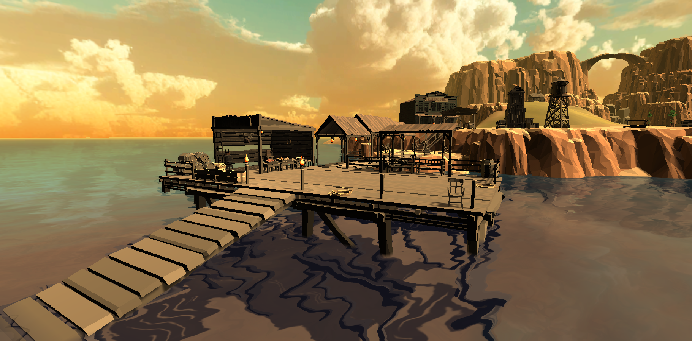

# Static World

This documentation is more of an overview of the semestral project requirements and how the game fulfills them. This page provides links to the primary documentation, which provides more detailed information and backstory.

## Scenes

There are three standalone scenes in the game. However, the primary scene (open world) is more complex and can be divided into several logical units.

- **Golf Plains**
    - Golf Town
    - Dock
    - Cemetery
    - Train Station
    - Developer's Residence
    - North-east Minigolf Park
    - Coast Side Minigolf
    - Minigolf Island
- **Saloon**
- **Church**

### Most relevant documentation pages:
- [Scenes](../scenes.md)
    - [Golf Plains](../golf_plains.md)
        - [Golf Town](../golf_town.md)
    - [Saloon](../saloon.md)
    - [Church](../church.md)

## Static Objects

There have been used countless static objects throughout the scenes. Most of the objects are used from a low-poly western asset pack, but we have also modeled several assets ourselves to accommodate our needs.

### Most relevant documentation pages:
- [Assets](../assets.md)
    - [3rd party assets](../3party_assets.md)
    - [Original assets](../original_assets.md)
- [Golf Town](../golf_town.md)

## Dynamic Objects

In the game, we have five main non-playable characters that directly participate in the story or are interactable. All of theme are unique. Then, there are also 21 additional NPCs around the scenes. All of the characters will be dynamic.

We have also created a model of a horse, that will be animated.

### Most relevant documentation pages:

- [Characters](../characters.md)
    - [Main characters](../main_characters.md)
    - [Other NPCs](../other_npcs.md)
- [Animations](../animations.md)
- [3rd party assets](../3party_assets.md)
- [Original assets](../original_assets.md)

## Dwellings

All of our dwellings are unique, most of them being in the Golf Town. Each of our characters has a specific place where they spend most of their time or reside. Some characters might change their position as time passes, however, they always return to their dwelling.

### Most relevant documentation pages:

- [Main characters](../main_characters.md)
- [Other NPCs](../other_npcs.md)
- [Golf Town](../golf_town.md)
- [Animations](../animations.md)